# goconfgen

`goconfgen` is a standalone Go configuration package generator.

It reads a declarative YAML schema and emits a reusable Go package with typed
configuration structs, defaults, parsers, renderers, CLI override helpers,
validation, generated enums, optional branch interfaces, and embedded presets.

The generated result is a Go package, not a serialized artifact. Applications
import the generated package directly and stop depending on `goconfgen` at
runtime.

## What It Generates

For one schema, `goconfgen` produces a directory of Go files:

| File               | Responsibility                                                                                    |
|--------------------|---------------------------------------------------------------------------------------------------|
| `types_gen.go`     | `ConfigObj`, nested branch structs, generated interfaces, custom scalar helpers such as `SizeObj` |
| `accessors_gen.go` | `New`, `ApplyDefaults`, origin tracking, merge helpers, generated setters                         |
| `enums_gen.go`     | enum types, constants, parsers, text/json marshal helpers                                         |
| `helpers_gen.go`   | shared runtime helpers used by parsers, renderers, CLI, duplicate-key checks, scalar conversion   |
| `parse_yaml.go`    | YAML parser when YAML format is enabled                                                           |
| `parse_json.go`    | JSON parser when JSON format is enabled                                                           |
| `parse_hjson.go`   | HJSON parser when HJSON format is enabled                                                         |
| `render_yaml.go`   | YAML renderer when YAML + render are enabled                                                      |
| `render_json.go`   | JSON renderer when JSON + render are enabled                                                      |
| `render_hjson.go`  | HJSON renderer when HJSON + render are enabled                                                    |
| `cli.go`           | CLI flag registration and `ApplyCLI` when CLI is enabled                                          |
| `validate.go`      | `Validate` when validation is enabled                                                             |
| `presets.go`       | embedded preset bytes and preset constructors when presets are enabled                            |
| `entrypoint.go`    | `ParseFile`, `LoadConfig`, primary parser selection                                               |

The checked-in example source is in
[examples/source](examples/source), and the generated reference package is in
[examples/complex/target](examples/complex/target).

## Generator Pipeline

The generator is split into four main stages:

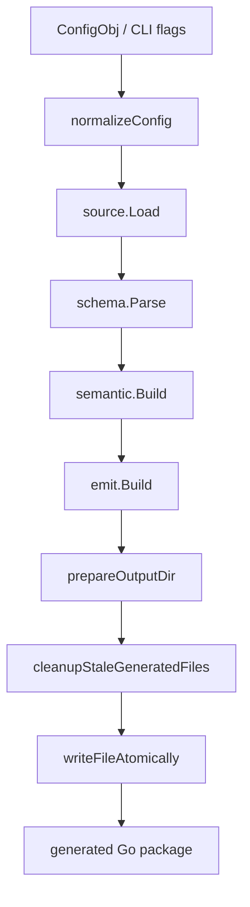

Stage responsibilities:

| Stage                | Code                | Responsibility                                                                    |
|----------------------|---------------------|-----------------------------------------------------------------------------------|
| config normalization | `config.go`         | resolve paths, formats, feature flags, package name, preset paths                 |
| source loading       | `internal/source`   | read schema and preset files as text                                              |
| schema parsing       | `internal/schema`   | parse YAML schema into strict branch/leaf model                                   |
| semantic build       | `internal/semantic` | derive Go names, field kinds, defaults, enum metadata, preset payloads            |
| emit                 | `internal/emit`     | render templates and `go/format` generated files                                  |
| write                | `write.go`          | create output directory, remove stale generated files, atomically replace outputs |

More detailed flow:

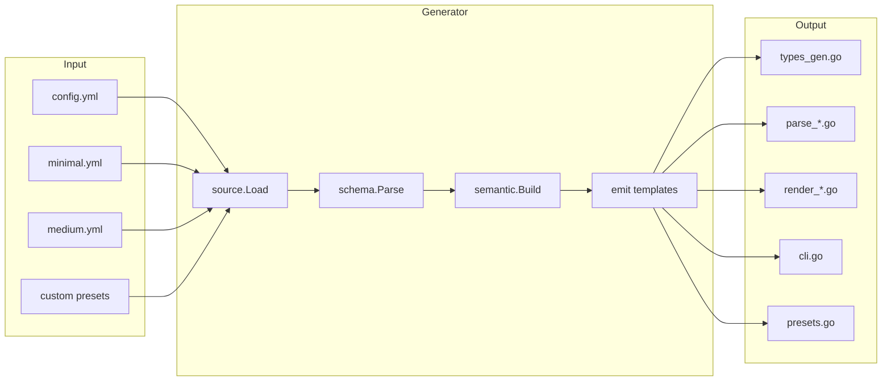

## Public Generator API

Library usage:

```go
package main

import "github.com/amazing-generators/goconfgen"

func main() {
	resultObj, err := goconfgen.Run(goconfgen.ConfigObj{
		SourceDir:   "./examples/source",
		OutputDir:   "./target",
		PackageName: "complexcfg",
		Formats:     []string{"yaml", "json", "hjson"},
		Force:       true,
	})
	if err != nil {
		panic(err)
	}

	_ = resultObj
}
```

CLI usage:

```bash
go run ./cmd/goconfgen \
  -source ./examples/source \
  -out ./target \
  -pkg complexcfg \
  -formats yaml,json,hjson \
  -force
```

`ConfigObj` fields:

| Field                 | Meaning                                                                            |
|-----------------------|------------------------------------------------------------------------------------|
| `Schema`              | explicit schema file path; otherwise `config.yml` is searched in `SourceDir`       |
| `SourceDir`           | directory containing `config.yml` and optional `minimal.yml` / `medium.yml`        |
| `OutputDir`           | target directory for generated Go files                                            |
| `PackageName`         | package name for generated code; derived from output directory when omitted        |
| `Formats`             | required library-side subset of `yaml`, `json`, `hjson`                            |
| `Presets`             | optional explicit preset paths as `map[string]string`                              |
| `Features.CLI`        | generate `cli.go`; nil means enabled                                               |
| `Features.Validate`   | generate `validate.go`; nil means enabled                                          |
| `Features.Render`     | generate render files; nil means enabled                                           |
| `Features.Presets`    | generate embedded presets; nil means enabled                                       |
| `Features.Interfaces` | generate schema-requested interfaces; nil means enabled                            |
| `Force`               | create missing output dir, overwrite generated files, remove stale generated files |

`Run` returns `ResultObj` with:

- output directory
- generated file paths
- resolved schema path
- resolved preset path map

## Schema Model

The input schema is YAML with two node kinds:

- branch nodes
- leaf nodes

Branch nodes may contain nested branches, leaf nodes, `usage`, and
`gen_interface`.

Leaf nodes may contain `type`, `usage`, `value`, `min`, `max`, `enum`, and
optional `enum_name`.

Example:

```yaml
server:
  usage:
    - HTTP server settings.
    - This branch demonstrates generated interfaces.
  gen_interface: true
  host:
    type: string
    usage: Listen host for inbound HTTP requests.
    value: 127.0.0.1
  port:
    type: int
    usage: Listen port for inbound HTTP requests.
    value: 8080
    min: 1
    max: 65535
```

Schema parsing flow:

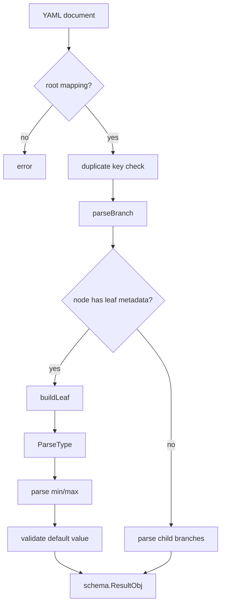

Strict schema rules:

- unsupported types fail generation
- duplicate mapping keys fail generation
- branch/leaf mixed metadata fails generation
- enum values must be non-empty and unique
- `enum_name` is normalized as an exported Go name; separators such as spaces
  and punctuation split words
- `enum_name` must start with an ASCII letter after normalization
- enum value `enum` is reserved because it would collide with the enum type
- enum defaults must match declared enum values
- `min` / `max` are supported only for scalar fields
- generated Go name collisions fail generation
- preset files are validated against the schema during generation
- unknown preset keys fail generation

## Supported Types

Scalar types:

- `string`
- `bool`
- `int`, `int8`, `int16`, `int32`, `int64`
- `uint`, `uint8`, `uint16`, `uint32`, `uint64`
- `float`, `float32`, `float64`
- `duration`
- `time.Duration`
- `size`
- inline `enum`

Array types:

- `[]string`
- `[]bool`
- `[]int`, `[]int8`, `[]int16`, `[]int32`, `[]int64`
- `[]uint`, `[]uint8`, `[]uint16`, `[]uint32`, `[]uint64`
- `[]float`, `[]float32`, `[]float64`
- `[]duration`
- `[]time.Duration`
- `[]size`
- `[]enum`

Map types:

- `map[string]string`
- `map[string][]string`
- `map[string]any`

`size` accepts byte units such as `b`, `kb`, `kib`, `mb`, `mib`, `gb`,
`gib`, `tb`, and `tib`. Rendered size values use canonical binary units when
the value divides exactly.

`duration` and `time.Duration` use Go's `time.ParseDuration` syntax.

## Semantic Model

`internal/semantic` translates the parsed schema into a generation-ready model:

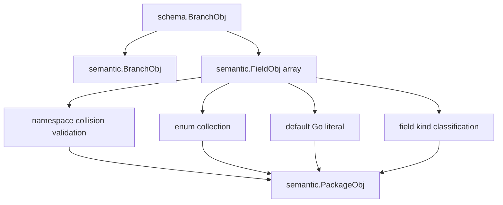

The semantic layer decides:

- generated struct names
- generated field accessors
- generated enum names
- field kind and bit size
- default Go literals
- feature compatibility
- preset availability
- primary format
- required import sets for templates

## Generated Runtime Flow

After generation, applications use the generated package directly:

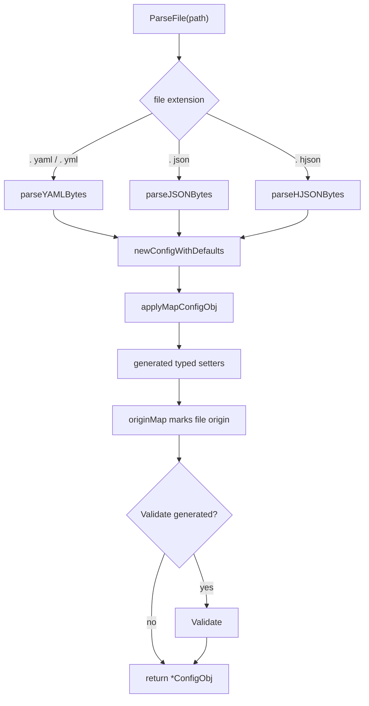

Primary runtime entrypoints:

| Entry                                                               | Meaning                                         |
|---------------------------------------------------------------------|-------------------------------------------------|
| `New() ConfigObj`                                                   | construct config with schema defaults           |
| `ParseFile(path string) (*ConfigObj, error)`                        | parse by file extension                         |
| `LoadConfig(filePath string, argsArr []string) (*ConfigObj, error)` | parse file, then apply CLI overrides            |
| `ApplyCLI(obj *ConfigObj, argsArr []string) error`                  | apply generated CLI flags to an existing object |
| `Validate() error`                                                  | validate enum and range rules when generated    |
| `RenderYAML(partial bool)`                                          | render YAML when generated                      |
| `RenderJSON(partial bool)`                                          | render JSON when generated                      |
| `RenderHJSON(partial bool)`                                         | render HJSON when generated                     |

## Parser Behavior

The three parsers share the same typed assignment path after decoding:

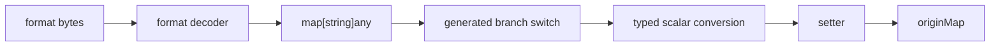

Format-specific behavior:

| Format | Duplicate keys                                        | Numeric path                     | Notes                                                                        |
|--------|-------------------------------------------------------|----------------------------------|------------------------------------------------------------------------------|
| YAML   | checked through `yaml.Node` traversal                 | YAML decoder native scalar types | comments are supported for rendered output                                   |
| JSON   | checked through `json.Decoder` token traversal        | decoded into `map[string]any`    | very large integers can lose precision because JSON numbers become `float64` |
| HJSON  | not guaranteed to detect duplicates before map decode | decoded into `map[string]any`    | duplicate-key strictness is weaker than JSON/YAML                            |

Parser scope:

- unknown schema keys are rejected
- map fields keep dynamic keys inside the field value
- duplicate JSON/YAML object keys are rejected
- HJSON duplicate-key rejection is not guaranteed
- parsers read the full input byte slice; `ParseFile` reads the full file
- there is no built-in input size limit
- JSON duplicate-key traversal has a nesting guard
- YAML and HJSON parsing rely on the underlying parser behavior for depth

## Origin Tracking

Generated config objects track value origin per schema path.

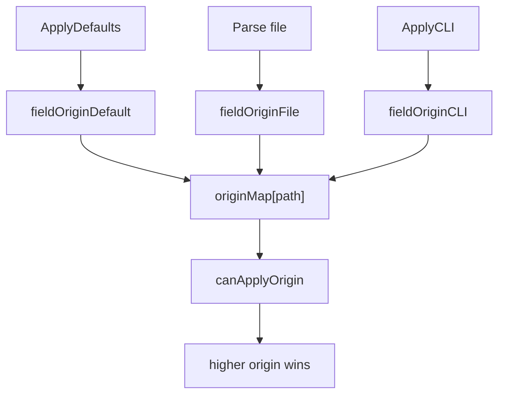

Origin order:

1. defaults
2. file
3. CLI

This allows `LoadConfig` to apply defaults, then file values, then CLI values
without lower-priority sources overwriting higher-priority values.

Important object semantics:

- `ConfigObj` is a normal Go struct with an internal `originMap`
- copying `ConfigObj` by value also copies the map reference
- generated setters and parsing are not designed for concurrent mutation
- treat a loaded config as immutable after construction if it is shared between goroutines
- use explicit application-level cloning if mutable copies are required

`HasPath(path string)` returns true for values provided by file or CLI, and false
for values that only came from defaults.

## CLI Override Behavior

Generated CLI flags are derived from leaf schema paths.

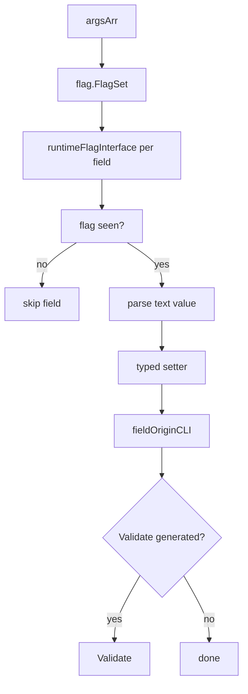

CLI parsing rules:

- scalar fields parse as scalar values
- bool flags accept Go bool syntax through `strconv.ParseBool`
- enum flags accept enum text
- duration flags use `time.ParseDuration`
- size flags use the generated size parser
- array flags use comma-separated text
- `map[string]string` accepts `key=value,key=value` shorthand first, then JSON fallback
- `map[string][]string` and `map[string]any` parse from JSON text

Example:

```bash
-server.port=9090
-features.enabled=metrics,tracing
-labels.common=env=prod,team=platform
```

## Rendering Behavior

Renderers are generated from the schema and preserve schema order.

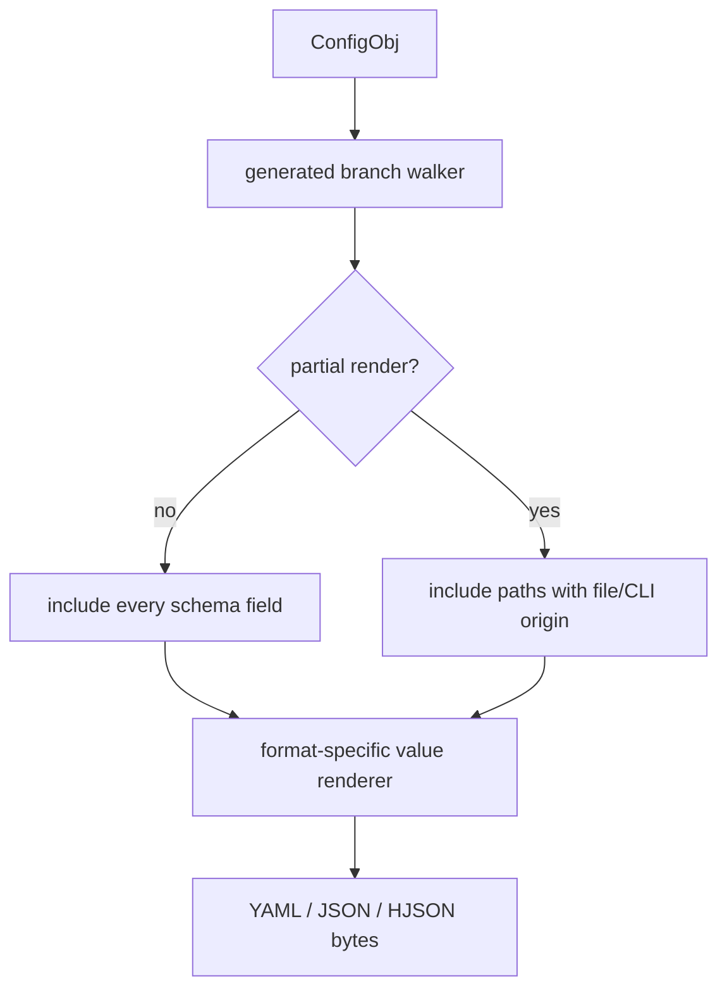

Renderer rules:

- field order follows schema order
- YAML and HJSON include comments from `usage`
- JSON is comment-free
- partial rendering includes only paths marked as file or CLI origin
- full rendering includes every schema field
- renderers use generated per-branch code instead of a runtime schema tree

`map[string]any` values are normalized before rendering so nested map keys are
stable.

## Presets

Presets are generated and embedded into the Go package.

Preset families:

- `full`
- `minimal`
- `medium`
- custom names supplied through `Presets` or repeated `-preset NAME=PATH`

Rules:

- `full` is always generated from schema defaults
- `minimal.yml` and `medium.yml` are optional
- `full` is reserved and cannot be supplied by the user
- explicit `minimal` / `medium` cannot conflict with autodetected files
- optional presets are validated against the schema during generation
- preset output is normalized to schema order
- preset bytes are embedded in `presets.go`

Generator-side preset flow:

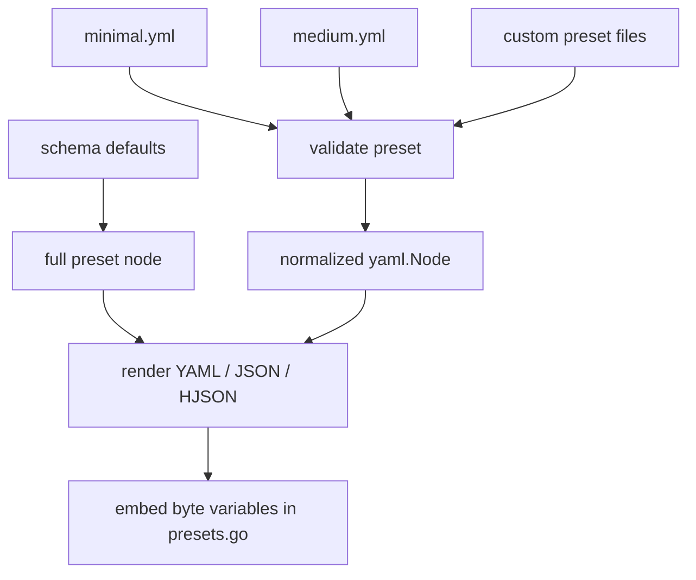

Runtime-side preset flow:

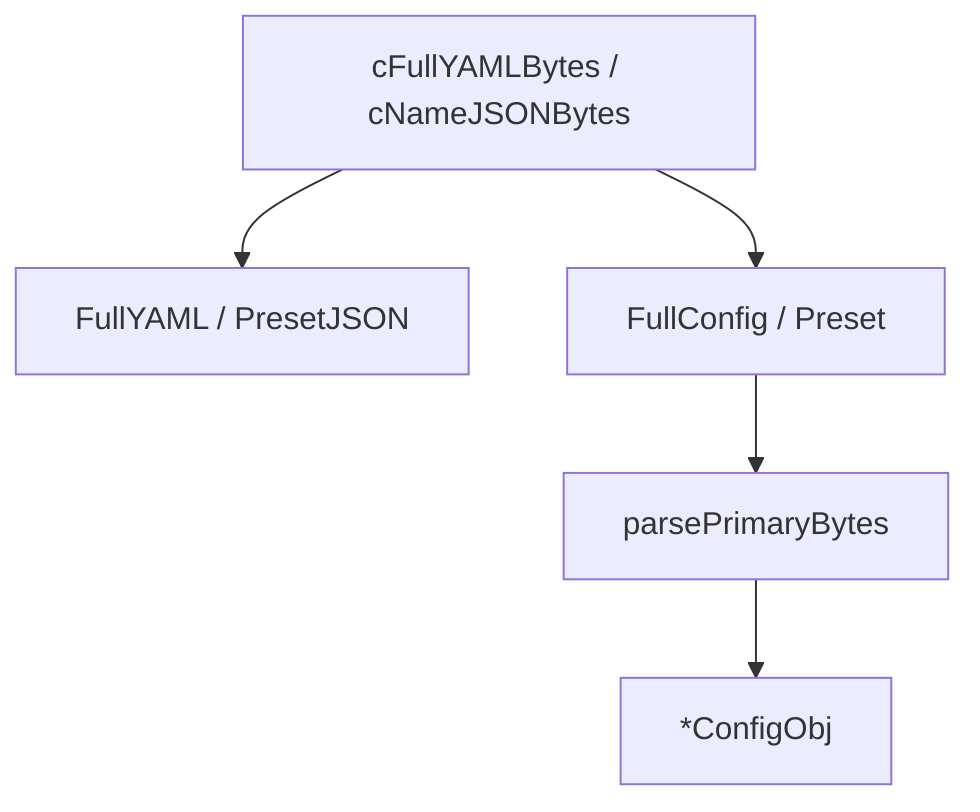

Generated preset helpers include:

- `FullConfig() *ConfigObj`
- `FullYAML()`, `FullJSON()`, `FullHJSON()` for enabled formats
- `HasMinimal()`, `MinimalConfig()`, `MinimalYAML()` and matching helpers when present
- `HasMedium()`, `MediumConfig()`, `MediumYAML()` and matching helpers when present
- `PresetNames() []string`
- `Preset(name string) (*ConfigObj, bool)`
- `PresetYAML(name string) ([]byte, bool)`
- `PresetJSON(name string) ([]byte, bool)`
- `PresetHJSON(name string) ([]byte, bool)`

## Enums

Inline schema enums become generated Go enum types.

Schema:

```yaml
logging:
  level:
    enum_name: global-log
    enum: [ debug, info, warn, error ]
    value: info
```

With `enum_name: global-log`, the generated type is `GlobalLogEnum` and values
are named `GlobalLogDebug`, `GlobalLogInfo`, `GlobalLogWarn`, and
`GlobalLogError`. When `enum_name` is omitted, names are derived from the schema
path as before.

Generated enum behavior:

- enum type
- constants for every value
- `String()`
- `IsValid()`
- parse helper
- text marshal/unmarshal
- JSON marshal/unmarshal

Enum arrays use the same enum type for each item.

## Interfaces

Branches marked with `gen_interface: true` generate Go interfaces.

The flag propagates into the subtree below the marked branch. This means nested
branches inherit interface generation when their parent branch requests it.

Generated interfaces expose getters for direct child branches and fields.

## Selective Generation

Formats and feature groups can be disabled at generation time.

Examples:

```go
falseFlag := false

_, err := goconfgen.Run(goconfgen.ConfigObj{
Schema:      "./config.yml",
OutputDir:   "./target",
PackageName: "yamlcfg",
Formats:     []string{"yaml"},
Features: goconfgen.FeaturesObj{
CLI:     &falseFlag,
Render:  &falseFlag,
Presets: &falseFlag,
},
Force: true,
})
```

Behavior:

- disabled formats do not emit their `parse_*` / `render_*` files
- disabled CLI does not emit `cli.go`
- disabled validation does not emit `validate.go`
- disabled presets do not emit `presets.go`
- `helpers_gen.go` is still emitted because it contains shared runtime helpers
- library calls must set `Formats` explicitly
- CLI defaults to `yaml,json,hjson`

## Operational Notes

These behaviors are intentional and should be understood by consumers:

- `ParseFile` reads the whole config file into memory.
- Generator source loading reads schema and presets into memory.
- There is no built-in file size limit.
- HJSON duplicate-key detection is weaker than JSON/YAML.
- JSON/HJSON numeric decoding goes through `map[string]any`; avoid very large JSON integer literals when exact `uint64`
  precision matters.
- Generated `ConfigObj` is mutable during parse/default/CLI application.
- Generated `ConfigObj` is not intended for concurrent mutation.
- Copying `ConfigObj` by value copies the internal `originMap` reference.
- Generated code favors direct typed code over reflection to keep runtime behavior inspectable and fast.
- Generated comments come from schema `usage`; keep schema usage text suitable for generated source and rendered config
  files.

## File Safety

`Run` writes only known generated file names.

Write behavior:

- unchanged files are not rewritten
- changed generated files require `Force`
- missing output directory requires `Force`
- stale known generated files are removed only in `Force` mode
- stale cleanup checks the generated header before removing a file
- writes use temp files and same-directory rename

This allows checked-in generated packages while protecting unrelated files in
the target directory.

## Repository Layout

| Path                      | Purpose                                                    |
|---------------------------|------------------------------------------------------------|
| `cmd/goconfgen`           | thin CLI wrapper                                           |
| `config.go`               | public config normalization                                |
| `run.go`                  | public generator entrypoint                                |
| `write.go`                | output directory and atomic write behavior                 |
| `internal/source`         | input file loading                                         |
| `internal/schema`         | schema parsing, type parsing, default validation           |
| `internal/semantic`       | Go name derivation, field model, presets, semantic checks  |
| `internal/emit`           | template rendering and generated file selection            |
| `internal/emit/templates` | templates for generated package files                      |
| `internal/yamltool`       | shared `yaml.Node` helpers                                 |
| `examples/source`         | example schema and optional presets                        |
| `examples/complex/target` | checked-in generated reference package                     |
| `examples/variants`       | selective generation examples                              |
| `run_test.go`             | integration tests around generation and generated packages |

## End-to-End Example

Generate a package:

```bash
go run ./cmd/goconfgen \
  -source ./examples/source \
  -out ./examples/complex/target \
  -pkg complexcfg \
  -formats yaml,json,hjson \
  -force
```

Use the generated package:

```go
package main

import (
	"fmt"

	"your/module/complexcfg"
)

func main() {
	obj, err := complexcfg.LoadConfig("./config.yml", []string{"-server.port=9090"})
	if err != nil {
		panic(err)
	}

	fmt.Println(obj.Server.Port)
}
```

Render a partial config containing only file/CLI-provided values:

```go
dataArr, err := obj.RenderYAML(true)
if err != nil {
panic(err)
}
fmt.Println(string(dataArr))
```

## Verification

The project is verified through generator and generated-package tests.

Main checks:

- `go test ./...`
- generated packages compile as standalone modules in integration tests
- generated defaults are checked
- YAML / JSON / HJSON parsers are exercised
- unknown config keys are rejected
- generated validation is exercised
- CLI override behavior is exercised
- selective generation removes stale generated files
- checked-in examples compile

Useful local commands:

```bash
go test ./...
go vet ./...
CGO_ENABLED=1 go test -race ./...
```

## Current Scope

`goconfgen` intentionally does not implement:

- application-specific business validation
- remote config loading
- include/import chains
- live reload orchestration
- runtime schema mutation
- automatic config size limits
- concurrent mutation control

The intended usage is to generate deterministic, checked-in-friendly Go runtime
configuration code from a strict declarative schema.
