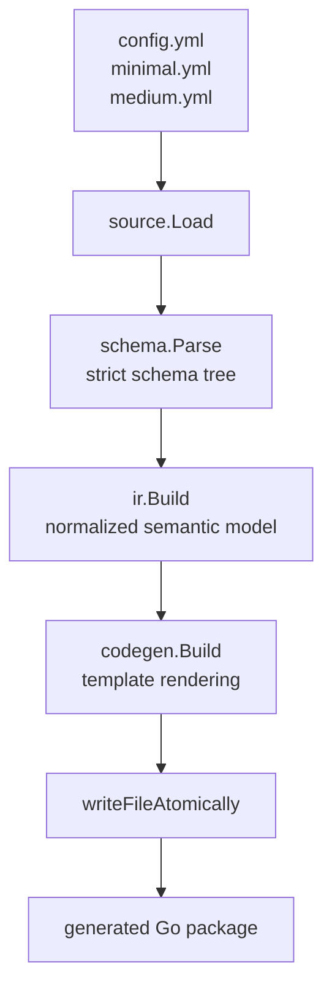
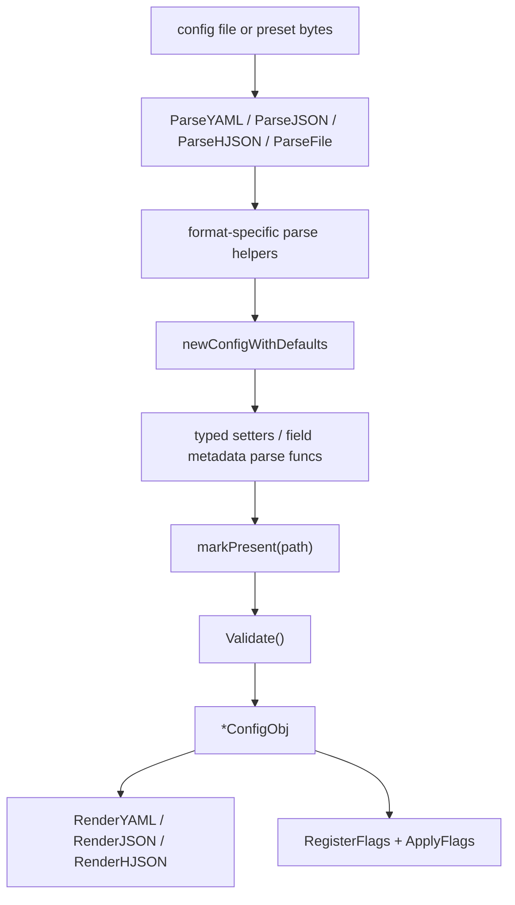
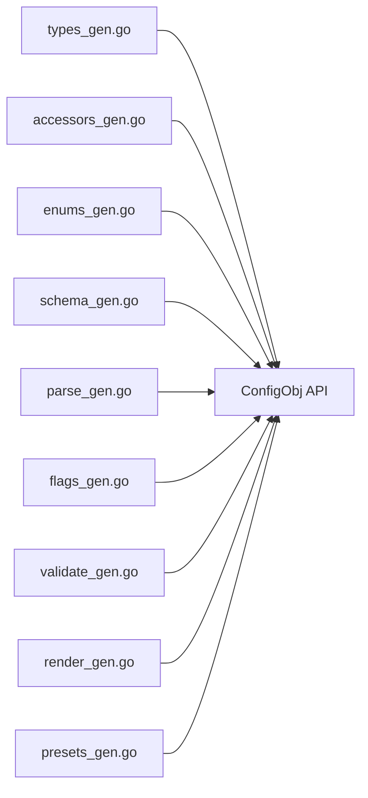
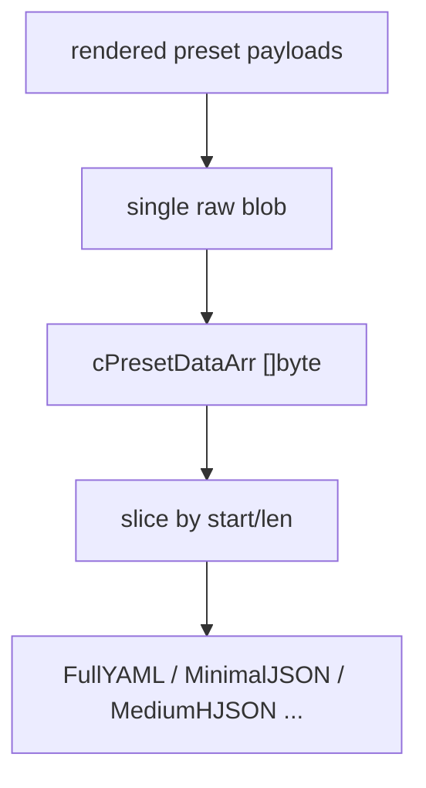

# goconfgen

`goconfgen` is a standalone Go config generator.

It reads a declarative YAML schema and generates a reusable Go config package with:

- typed config structs
- optional generated interfaces for selected branches
- inline enum types with parse and validation helpers
- defaults application
- YAML / JSON / HJSON parsing
- CLI flag registration and apply logic
- runtime validation
- YAML / JSON / HJSON rendering
- built-in `full`, `minimal`, and `medium` presets

The project is intentionally shaped as a reusable generator library with a thin CLI wrapper, not as a repo-local script
tied to one application.

## What It Generates

The generator outputs a directory with several responsibility-split Go files.

For the example schema
in [examples/complex/source](/mnt/w541-data/shared/GolandProjects/goconfgen/examples/complex/source), the generated
result is checked in
at [examples/complex/target](/mnt/w541-data/shared/GolandProjects/goconfgen/examples/complex/target).

Current generated files:

- `types_gen.go`: config structs, branch interfaces, custom scalar helpers like `SizeObj`
- `accessors_gen.go`: defaults application, presence tracking, field getters/setters
- `enums_gen.go`: enum types, constants, parse functions, string helpers
- `schema_gen.go`: static schema tree used by parser and renderer
- `parse_gen.go`: `ParseFile`, `ParseYAML`, `ParseJSON`, `ParseHJSON`
- `flags_gen.go`: CLI flags, `ApplyFlags`, help/defaults text
- `validate_gen.go`: generated runtime validation
- `render_gen.go`: YAML / JSON / HJSON rendering and save helpers
- `presets_gen.go`: embedded presets and preset accessors

The output is a Go package, not a serialized artifact dump. You import and use the generated code in another project.

## Generator Flow

At a high level, `goconfgen` does four things:

1. loads schema and optional preset sources
2. parses and validates them into a strict semantic model
3. generates multiple Go files from templates
4. writes the generated package to the target directory



More concretely:

- [run.go](/mnt/w541-data/shared/GolandProjects/goconfgen/run.go:1) is the public generator entrypoint
- [internal/source](/mnt/w541-data/shared/GolandProjects/goconfgen/internal/source) resolves and loads input files
- [internal/schema](/mnt/w541-data/shared/GolandProjects/goconfgen/internal/schema) parses and validates the schema
- [internal/ir](/mnt/w541-data/shared/GolandProjects/goconfgen/internal/ir) builds the normalized package model and
  rendered presets
- [internal/codegen](/mnt/w541-data/shared/GolandProjects/goconfgen/internal/codegen) renders `*_gen.go` files from
  templates in [internal/codegen/templates](/mnt/w541-data/shared/GolandProjects/goconfgen/internal/codegen/templates)

## Public Generator API

Library usage:

```go
package main

import "github.com/amazing-generators/goconfgen"

func main() {
  _, err := goconfgen.Run(goconfgen.ConfigObj{
    SourceDir:   "./examples/complex/source",
    OutputDir:   "./target",
    PackageName: "complexcfg",
    Force:       true,
  })
  if err != nil {
    panic(err)
  }
}
```

CLI usage:

```bash
go run ./cmd/goconfgen \
  -source ./examples/complex/source \
  -out ./target \
  -pkg complexcfg \
  -formats yaml,json,hjson \
  -with-cli=true \
  -force
```

CLI wrapper location:

- [cmd/goconfgen/main.go](/mnt/w541-data/shared/GolandProjects/goconfgen/cmd/goconfgen/main.go:1)

Main input fields of `ConfigObj`:

- `SourceDir`: directory containing `config.yml` and optional `minimal.yml` / `medium.yml`
- `SchemaPath`: explicit schema file path
- `MinimalPath`: explicit minimal preset path
- `MediumPath`: explicit medium preset path
- `OutputDir`: target directory for generated package files
- `PackageName`: Go package name for the generated package
- `Formats`: optional subset of `yaml`, `json`, `hjson`; empty means all formats
- `WithCLI`: optional toggle for `flags_gen.go`; `nil` means enabled by default
- `Force`: allow creation of missing output directories and overwrite existing generated files

`Run` returns `ResultObj`, which reports:

- output directory
- generated file paths
- resolved schema path
- resolved optional preset paths

Presets are embedded directly into the generated Go package, so no standalone preset files are produced.

## Input Schema Model

The schema is a YAML tree made of two node kinds:

- branch nodes
- leaf nodes

A branch may contain:

- nested branches
- `usage`
- `gen_interface: true`

A leaf may contain:

- `type`
- `usage`
- `value`
- `min`
- `max`
- `enum`

Example:

```yaml
server:
  usage:
    - HTTP server settings.
    - This branch demonstrates generated interfaces.
  gen_interface: true
  host:
    type: string
    usage: Listen host for inbound HTTP requests.
    value: 127.0.0.1
  port:
    type: int
    usage: Listen port for inbound HTTP requests.
    value: 8080
    min: 1
    max: 65535
```

Full example schema:

- [examples/complex/source/config.yml](/mnt/w541-data/shared/GolandProjects/goconfgen/examples/complex/source/config.yml:1)

## Supported Types

Currently supported scalar types:

- `string`
- `bool`
- `int`, `int8`, `int16`, `int32`, `int64`
- `uint`, `uint8`, `uint16`, `uint32`, `uint64`
- `float`, `float32`, `float64`
- `duration`
- `time.Duration`
- `size`
- inline `enum`

Currently supported array types:

- `[]string`
- `[]bool`
- `[]int*`
- `[]uint*`
- `[]float*`
- `[]duration`
- `[]time.Duration`
- `[]size`
- `[]enum`

Currently supported map types:

- `map[string]string`
- `map[string][]string`
- `map[string]any`

Schema validation is strict:

- unsupported types fail generation
- enum defaults must match declared enum values
- `min` / `max` are supported only for scalar fields
- preset files are validated against the schema during generation
- duplicate mapping keys are rejected
- unknown preset keys are rejected
- unknown config keys are rejected during runtime parsing

## Presence Semantics

One of the central design points is explicit presence tracking.

Generated `ConfigObj` does not treat “field is absent” and “field is present with zero value” as the same thing. The
generated package keeps a `presenceMap` and marks fields when they were explicitly provided by parse or CLI override
logic.

This matters for:

- rendering only explicitly present fields
- preserving semantic difference between omitted and explicit zero values
- applying CLI overrides on top of defaults
- future merge-like workflows

Generated presence helpers live in:

- [examples/complex/target/accessors_gen.go](/mnt/w541-data/shared/GolandProjects/goconfgen/examples/complex/target/accessors_gen.go:1)

The important generated methods are:

- `New() ConfigObj`
- `ApplyDefaults()`
- `HasPath(path string) bool`

## How the Generated Package Works

After generation, consumers do not interact with `goconfgen` anymore. They interact with the generated package.

Main runtime flow:



The generated package contains three important layers:

- typed config model
- generated schema metadata
- standalone generated runtime helpers in `runtime_gen.go`

Generated parse entrypoints:

- `ParseFile(path string) (*ConfigObj, error)`
- `ParseYAML(data []byte) (*ConfigObj, error)`
- `ParseJSON(data []byte) (*ConfigObj, error)`
- `ParseHJSON(data []byte) (*ConfigObj, error)`

Generated render entrypoints:

- `RenderYAML(obj *ConfigObj) ([]byte, error)`
- `RenderYAMLPresent(obj *ConfigObj) ([]byte, error)`
- `RenderJSON(obj *ConfigObj) ([]byte, error)`
- `RenderJSONPresent(obj *ConfigObj) ([]byte, error)`
- `RenderHJSON(obj *ConfigObj) ([]byte, error)`
- `RenderHJSONPresent(obj *ConfigObj) ([]byte, error)`

Generated validation entrypoint:

- `Validate() error`

When validation generation is enabled, generated parse entrypoints validate the parsed object before returning it.

Generated CLI helpers:

- `RegisterFlags(flagSet *flag.FlagSet)`
- `ApplyFlags(obj *ConfigObj) error`
- `HelpText() string`
- `FullPresetText() string` (renders the full preset in the primary enabled format)

## Selective Generation

Formats and CLI generation can be trimmed at generation time.

- `Formats: []string{"yaml"}` generates only YAML parse/render/preset entrypoints
- `WithCLI: ptr(false)` skips `flags_gen.go` completely
- empty `Formats` keeps the historical default and generates YAML, JSON, and HJSON together

When a format is disabled, the generated package also drops its format-specific imports and runtime helpers.

Generated package example files:

- [examples/complex/target/types_gen.go](/mnt/w541-data/shared/GolandProjects/goconfgen/examples/complex/target/types_gen.go:1)
- [examples/complex/target/parse_gen.go](/mnt/w541-data/shared/GolandProjects/goconfgen/examples/complex/target/parse_gen.go:1)
- [examples/complex/target/render_gen.go](/mnt/w541-data/shared/GolandProjects/goconfgen/examples/complex/target/render_gen.go:1)
- [examples/complex/target/flags_gen.go](/mnt/w541-data/shared/GolandProjects/goconfgen/examples/complex/target/flags_gen.go:1)
- [examples/complex/target/validate_gen.go](/mnt/w541-data/shared/GolandProjects/goconfgen/examples/complex/target/validate_gen.go:1)

## Generated Runtime Structure

The generated package is split so that each concern stays isolated.



That split is intentional:

- runtime parsing uses `schema_gen.go` plus setter/getter code from `accessors_gen.go`
- rendering uses the same schema tree to preserve field order and comments
- validation is generated as plain Go checks instead of reflection-driven rules
- presets are embedded into code so the package is self-contained

## Presets

`goconfgen` supports three preset families:

- `full`
- `minimal`
- `medium`

Rules:

- `full` is always generated from schema defaults
- `minimal.yml` is optional
- `medium.yml` is optional
- optional presets are validated against the schema during generation
- preset output is normalized to schema order
- YAML and HJSON presets preserve schema usage comments

Preset accessors are generated only for enabled formats.

Preset accessors are generated into `presets_gen.go`:

- `HasFull()`, `HasMinimal()`, `HasMedium()`
- `FullYAML()`, `FullJSON()`, `FullHJSON()`
- `MinimalYAML()`, `MinimalJSON()`, `MinimalHJSON()`
- `MediumYAML()`, `MediumJSON()`, `MediumHJSON()`
- `FullConfig()`, `MinimalConfig()`, `MediumConfig()`

### Embedded Preset Layout

Presets are not emitted as external files anymore.

Instead, generator-side preset rendering works like this:

1. render each preset in YAML, JSON, and HJSON form
2. concatenate all rendered preset payloads into one raw byte blob
3. store per-preset `start` / `len` constants
4. embed that byte slice directly into generated code

Runtime-side access works like this:



This layout keeps the generated package simple and removes extra runtime dependencies from preset access.

Example implementation:

- [examples/complex/target/presets_gen.go](/mnt/w541-data/shared/GolandProjects/goconfgen/examples/complex/target/presets_gen.go:1)

## Rendering Behavior

Renderer behavior is schema-driven, not struct-order-driven.

That means:

- field order follows schema order
- branch and field comments come from schema `usage`
- YAML output contains comments
- HJSON output contains comments
- JSON output is comment-free, as expected
- `Render*Present` variants include only explicitly present fields

This is why the generated package keeps a runtime schema tree in `schema_gen.go`.

## Enums and Interfaces

Enums are declared inline in the schema and become typed generated Go enums.

Example schema fragment:

```yaml
logging:
  level:
    enum: [ debug, info, warn, error ]
    value: info
```

Generated result:

- enum type with stable hashed name
- per-value constants
- parse helper
- `String()` and validity helpers

Interfaces are generated for branches marked with `gen_interface: true`.

That flag propagates to the whole subtree below the marked branch, so nested branches inherit interface generation automatically.

In the example:

- `server.gen_interface: true`
- generated `ServerInterface`

Example generated interface:

- [examples/complex/target/types_gen.go](/mnt/w541-data/shared/GolandProjects/goconfgen/examples/complex/target/types_gen.go:1)

## CLI Override Behavior

Generated CLI flags are derived from schema leaves.

Important behaviors:

- scalar fields parse as typed scalar values
- enum fields accept enum text
- duration fields parse with `time.ParseDuration`
- size fields parse with size parser
- array string flags parse as CSV and append to existing arrays
- `map[string]string` accepts shorthand first, then JSON as fallback
- structured maps like `map[string][]string` and `map[string]any` parse from JSON

Example:

```bash
-server.port=9090
-features.enabled=metrics,tracing
-labels.common=env=prod,team=platform
```

Generated implementation example:

- [examples/complex/target/flags_gen.go](/mnt/w541-data/shared/GolandProjects/goconfgen/examples/complex/target/flags_gen.go:1)

## Templates

Generated files are emitted through templates, not assembled line-by-line as full files.

Template entrypoint:

- [internal/codegen/template.go](/mnt/w541-data/shared/GolandProjects/goconfgen/internal/codegen/template.go:1)

Template directory:

- [internal/codegen/templates](/mnt/w541-data/shared/GolandProjects/goconfgen/internal/codegen/templates)

This keeps generation deterministic, easier to reason about, and easier to extend when new output files are added.

## Repository Layout

- `cmd/goconfgen`: thin CLI wrapper
- `internal/source`: input file loading
- `internal/schema`: schema parsing and validation
- `internal/ir`: semantic normalization and preset rendering
- `internal/codegen`: template-based file generation
- `internal/codegen/templates`: text/template sources for every generated file (runtime helpers are emitted inline into
  the generated package, not imported from a shared runtime)
- `internal/naming`: shared `GoName`/`GoTypeName` translation for all layers
- `internal/yamltool`: shared `yaml.Node` helpers (clone, duplicate-key check) used by schema and ir
- `examples/complex/source`: example source schema and optional presets
- `examples/complex/target`: checked-in generated example package
- `run_test.go`: integration test that regenerates the example package and compiles + runs a smoke test against it

## Example End-to-End Usage

Generate package:

```bash
go run ./cmd/goconfgen \
  -source ./examples/complex/source \
  -out ./examples/complex/target \
  -pkg complexcfg \
  -force
```

Re-generate the checked-in example package:

```bash
go run ./cmd/goconfgen -source ./examples/complex/source -out ./examples/complex/target -pkg complexcfg -force
```

Consume generated package:

```go
package main

import (
  "fmt"

  "your/module/complexcfg"
)

func main() {
  obj, err := complexcfg.ParseYAML([]byte(`
server:
  port: 9090
logging:
  level: warn
`))
  if err != nil {
    panic(err)
  }

  fmt.Println(obj.Server.Port)
}
```

## Verification

The project is verified with live generation and compile-time checks.

Main integration path:

1. regenerate the example package into a temp directory
2. compare its **file layout** with the checked-in example (`examples/complex/target`); generated file contents differ
   between runs because of the embedded `Generated at: <timestamp>` header and are therefore not compared byte-for-byte
3. create a temporary module around the freshly generated package
4. run `go mod tidy`
5. run `go test ./...`
6. exercise the generated package via a smoke test that validates defaults, parses presets in every format,
   round-trips YAML / JSON / HJSON, checks HJSON preserves usage comments, and verifies CLI overrides apply correctly

The main integration test is here:

- [run_test.go](/mnt/w541-data/shared/GolandProjects/goconfgen/run_test.go:1)

## Current Scope

`goconfgen` is for generating generic configuration runtime code.

It intentionally does not try to implement:

- application-specific business validation
- startup orchestration
- config include / redirect chains
- dynamic schema mutation at runtime

It takes a declarative schema and produces a deterministic, checked-in-friendly Go package that another project can
import and use directly.
